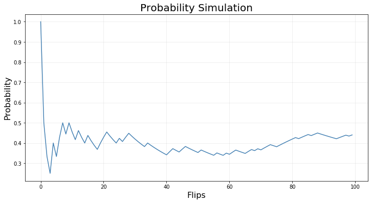
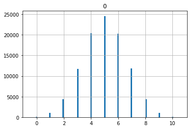

## Probability with Simulations


```python
import numpy as np 
import matplotlib.pylab as plt
%matplotlib inline
```

### Simple probabilities

We can use numpy's [random.choice](https://docs.scipy.org/doc/numpy/reference/generated/numpy.random.choice.html) function to take samples from a defined sample space and estimate probability. 

For a fair coin we have to states:


```python
x = ['h','t']
```

Simulate coin flips with the random choice function.


```python
for i in range(5):
    print (np.random.choice(x))
```

    t
    t
    t
    t
    h


Try to simulate many flips of the coin and store the results in an array by passing the `size` parameter to `np.random.choice`


```python
flips = np.random.choice(x, size=10)
print(flips)
```

    ['h' 'h' 't' 't' 't' 'h' 't' 't' 't' 'h']


Now suppose we want to run a simple simulation to estimate the probability that the coin comes up Heads (which we expect to be .5 because the coin is fair). One way to do this is to do a large number of coin flips and then divide the number of flips that come up Heads by the total number of flips. Flip the coin 50 times and compute the results


```python
np.random.seed(12345)
flips = np.random.choice(x, size=50)
approx_prob_heads = np.sum(flips == "h") / len(flips)
print("the probability of heads:{:.3f}".format(approx_prob_heads))
```

    the probability of heads:0.360


Let's see what happens if we rerun the simulation with an increasing number of coin flips.


```python
np.random.seed(12345)
flips = np.random.choice(x, size=100)
approx_prob_heads = np.sum(flips == "h") / len(flips)
print("the probability of heads: {:.3f}".format(approx_prob_heads))
```

    the probability of heads: 0.440


It's an interesting exercise to make a plot of the running estimate of the probability as the number of coin flips increases. We'll use the same random sequence of coin flips from the previous simulation.


```python
p = np.zeros(len(flips))
for ii in range(len(p)):
    p[ii] = np.sum(flips[:ii+1] == "h") / len(flips[:ii+1])
    
fig, ax = plt.subplots(figsize=(12,6))
ax.plot(p, color="steelblue")
ax.set_title("Probability Simulation", fontsize=20)
ax.set_xlabel("Flips", fontsize=16)
ax.set_ylabel("Probability", fontsize=16)

ax.grid(True, alpha=0.25)
```





### The Binomial Distribution

A binomial distribution can be thought of as simply the probability of a SUCCESS or FAILURE outcome in an experiment or survey that is repeated multiple times. The binomial is a type of distribution that has two possible outcomes (the prefix “bi” means two, or twice). For example, a coin toss has only two possible outcomes: heads or tails and taking a test could have two possible outcomes: pass or fail.

The binomial is defined by two parameters: the probability of success in any given trial and the number of trials. The binomial distribution tells you how likely it is to achieve a given number of successes in n trials of the experiment. 

For example, we could model flipping a fair coin 10 times with a binomial distribution where the number of trials is set to 10 and the probability of success is set to 0.5. In this case the distribution would tell us how likely it is to get zero heads, 1 head, 2 heads and so on.

Python's Scipy library has a built in function for calculating binomial distributions called `binom`.


```python
import pandas as pd
import scipy.stats  as stats
```


```python
coin_flip  = stats.binom.rvs(n=10, p=0.5, size=100000)  
print( pd.crosstab(index="counts", columns= coin_flip))
pd.DataFrame(coin_flip).hist(range=(-0.5,10.5), bins=101)
```

    col_0    0    1     2      3      4      5      6      7     8     9    10
    row_0                                                                     
    counts  116  987  4417  11787  20435  24589  20301  11851  4396  1019  102


    array([[<matplotlib.axes._subplots.AxesSubplot object at 0x1a152107f0>]],
          dtype=object)





```python
# Lets try to run above with a biased coin
```
